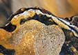
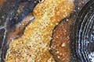
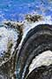
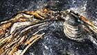
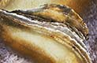

From our travels around the world we come across some amazing discoveries. With a little visual imagination they can take on aspects that resemble yet another world.

<h2>Links</h2>

<a href="http://www.pro-imaging.org/portfolios/norman-childs/" title="Portfolio on Pro-Imaging website">Pro-Imaging.Org</a>

<a href="http://www.alamy.com/stock-photography/69F0887E-D730-46DA-9969-9E5963A27AF5/Greenshoots%20Communications.html">GreenShoots Image Library on Alamy.com</a>

<!--
[Pro-Imaging.Org](http://www.pro-imaging.org/portfolios/norman-childs/ "Portfolio on Pro Imaging website")

[GreenShoots Image Library on Alamy.com](http://www.alamy.com/stock-photography/69F0887E-D730-46DA-9969-9E5963A27AF5/Greenshoots%20Communications.html)
-->

